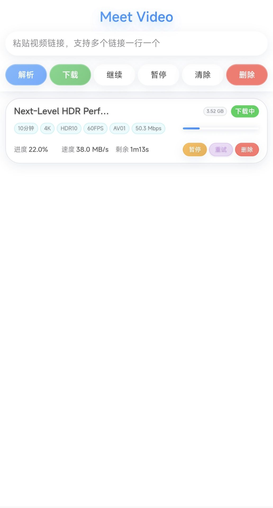
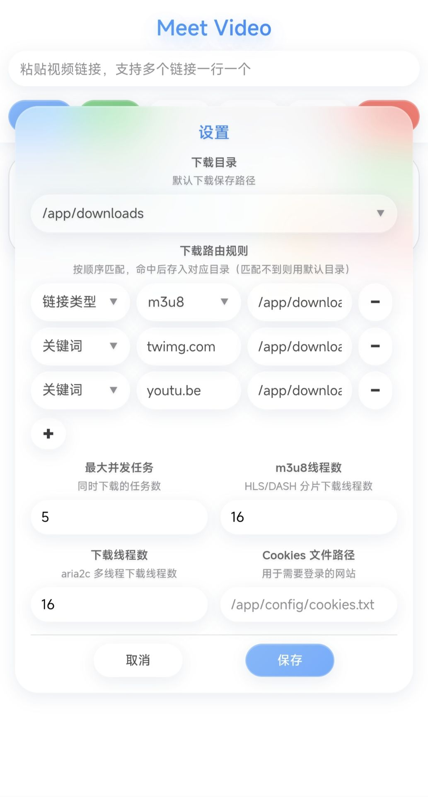
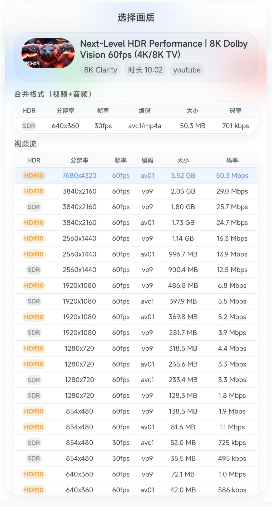

<h1 align="center">Meet Video</h1>
<p align="center">
  <em>一个功能强大的视频下载工具，支持多种视频网站和流媒体格式。</em>
</p>
<p align="center">
  基于 <a href="https://github.com/yt-dlp/yt-dlp">yt-dlp</a> 和 <a href="https://github.com/FFmpeg/FFmpeg">FFmpeg</a>
</p>
<p align="center">
  <a href="https://github.com/wuanqicll-del/Meet-Video"></a>
  <a href="https://hub.docker.com/r/wuanqicll/meet-video"></a>
</p>

---

**如果好用，请 Star！非常感谢！** [GitHub](https://github.com/wuanqicll-del/Meet-Video) · [DockerHub](https://hub.docker.com/r/wuanqicll/meet-video)

---

<details>
<summary><strong>点击展开截图</strong></summary>

<p align="center">
  
</p>

<p align="center">
  
</p>

<p align="center">
  
</p>

</details>

---

## 功能特点

**隐藏设置**
- 所有设置项点击顶部logo弹出设置页面
- 双击页面任何位置显示任务统计浮窗
- 任务失败的时候点击失败二字会显示具体原因
- 标题过长点击标题会显示完整内容

**核心功能**
- 支持多种视频网站（YouTube、Twitter、Bilibili 等）
- 支持 m3u8/HLS/DASH 流媒体下载
- 支持多线程下载
- 支持格式选择（不同画质、音频）（需点击解析）
- 直接点击下载默认最高音画质
- 支持批量下载（多个链接一行一个）
- 支持 Cookies（需要登录的网站）
- 支持浏览器猫抓插件一键发送下载

**任务管理**
- 实时进度显示（速度、进度、剩余时间）
- 支持暂停、继续、重试、删除任务
- 支持批量操作（全部暂停、全部继续、清除已完成）
- 任务状态实时更新（SSE 推送）

**智能路由**
- 根据 URL 类型自动选择下载目录（m3u8、直链、其他分享）
- 支持自定义路由规则，根据类型或者关键词自动选择下载目录

**配置管理**
- 可配置默认下载目录
- 可配置最大并发任务数
- 可配置 m3u8 线程数
- 可配置 aria2c 下载线程数
- 可配置 Cookies 文件路径

---

## 用途举例

**1. 视频下载**

从各种视频网站下载视频，支持选择不同画质和格式。

**2. 批量下载**

同时粘贴多个链接，一键批量下载。

**3. 流媒体下载**

支持 m3u8/HLS/DASH 流媒体格式，自动合并分片。

---

## 特性

- 开源免费，接受任意审查
- [Github Actions](https://docs.github.com/zh/actions) 自动打包与发布，过程公开透明
- 支持 Docker，下载即用（支持 AMD64 和 ARM64 架构）
- 干净卸载，不用的时候删掉即可，无任何残留
- 完全离线运行，永不上传用户隐私
- 完善的错误处理，稳定可靠
- 完善的日志，所有错误都会被记录
- 支持多种下载方式（yt-dlp 原生、aria2c 多线程）
- 支持多种视频格式（mp4、webm、mkv、avi、mov、flv 等）
- 支持多种流媒体格式（m3u8、HLS、DASH）
- 实时进度显示（速度、进度、剩余时间）
- 支持任务暂停、继续、重试、删除
- 支持批量操作
- 支持自定义下载路由规则
- 支持 Cookies（需要登录的网站）

---

## 使用方法

### Docker 部署（推荐）

```bash

# 运行容器
docker run -d \
  --name meet-video \          # 容器名称
  -p 5000:5000 \               # 端口映射：宿主机端口:容器端口
  -v ./config:/app/config \      # 配置文件挂载
  -v ./downloads:/app/downloads \ # 下载目录挂载
  --restart unless-stopped \           # 重启策略：除非手动停止，否则总是重启
  wuanqicll/meet-video:latest          # 镜像名称:标签
```

### Docker Compose 部署

创建 `docker-compose.yml`：

```yaml
services:
  ytdlp-downloader:
    image: wuanqicll/meet-video:latest  # 镜像名称:标签（从DockerHub拉取）
    container_name: ytdlp-downloader    # 容器名称
    restart: always                     # 重启策略：总是重启
    init: true                          # 启用init进程，正确处理信号和僵尸进程
    network_mode: "bridge"              # 网络模式：桥接模式
    ports:
      - "5000:5000"                     # 端口映射：宿主机端口:容器端口
    healthcheck:                        # 健康检查配置
      test: ["CMD", "wget", "-q", "--spider", "http://localhost:5000/api/config"]  # 检查API是否正常响应
      interval: 30s                     # 检查间隔：30秒
      timeout: 10s                      # 超时时间：10秒
      retries: 3                        # 重试次数：3次
      start_period: 10s                 # 启动等待时间：10秒
    volumes:
      - ./config:/app/config            # 配置和任务记录挂载
      - ./downloads:/app/downloads      # 下载目录挂载
```

启动服务：

```bash
docker-compose up -d
```

### 访问 WebUI

打开浏览器访问：`http://你的IP:5000`

---

## 猫抓一键发送配置

在猫抓扩展中添加自定义一键发送配置：

| 配置项 | 值 |
| :--- | :--- |
| 请求方式 | `POST` |
| Content-Type | `application/json;charset=utf-8` |
| 地址 | `http://你的IP:5052/api/download` |
| 请求体 | `{"url":"${url}","title":"${title}"}` |

**使用方法：**
1. 在猫抓扩展中找到视频链接
2. 点击一键发送按钮
3. 视频会自动发送到 Meet-Video 开始下载

---

## 技术栈

**后端**
- Python 3
- Flask Web 框架
- yt-dlp 视频下载
- aria2c 多线程下载
- ffmpeg 视频处理

**前端**
- 原生 HTML/CSS/JavaScript
- 响应式设计（支持移动端）
- SSE 实时进度推送

**部署**
- Docker 容器化
- 多架构支持（AMD64/ARM64）
- GitHub Actions 自动构建

---

## 目录结构

```
meet-video/
├── app/
│   ├── app.py          # 主应用（后端逻辑）
│   ├── webui.py        # WebUI 入口
│   ├── static/         # 静态文件（CSS、JS）
│   └── templates/      # 模板文件（HTML）
├── Dockerfile          # Docker 构建文件
└── README.md           # 说明文档
```

---

## 常见问题

**1. 如何更新版本？**

```bash
# 拉取最新镜像
docker pull wuanqicll/meet-video:latest

# 重启容器
docker-compose down
docker-compose up -d
```

**2. 如何备份数据？**

备份 `/app/config` 目录（配置文件）和 `/app/downloads` 目录（下载文件）。

**3. 支持哪些网站？**

支持所有 yt-dlp 支持的网站，包括 YouTube、Twitter、Bilibili、抖音等。

**4. 如何使用 Cookies？**

将 Cookies 文件放到 `/app/config/cookies.txt`，然后在设置中配置路径。

**5. 下载速度慢怎么办？**

- 增加 下载线程数（aria2c 线程数）
- 增加 m3u8线程数（m3u8 线程数）
- 检查网络连接

---

## 许可证

MIT License

---

## 项目地址

- GitHub：https://github.com/wuanqicll-del/Meet-Video
- DockerHub：https://hub.docker.com/r/wuanqicll/meet-video
